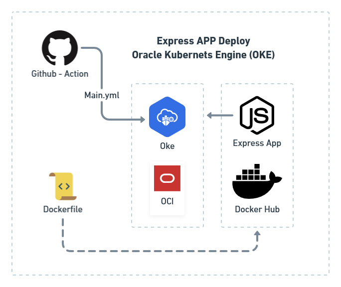

# Github Actions setup for Node App using Oracle Cloud Infrastructure (OCI) - OKE

This repo contains the min requeriments to deploy an Express Application in Oracle Kubernetes Engine (OKE) and the automation pipeline with github actions.

## References

- [CI/CD on Oracle Kubernetes Engine using Github Action](https://blog.kube-mesh.io/ci-cd-on-oracle-kubernetes-engine-using-github-action/)
- [Adventures in CI/CD [#4]: Deploying A Microservice To The Oracle Cloud With GitHub Actions [OCI CLI Edition]](https://blogs.oracle.com/developers/post/adventures-in-cicd-4-deploying-a-microservice-to-the-oracle-cloud-with-github-actions-oci-cli-edition)
- [Deploy Oracle Container Engine for Kubernetes](https://docs.oracle.com/en/learn/container_engine_kubernetes/#introduction)
- [Dockerizing a Node.js web app](https://nodejs.org/en/docs/guides/nodejs-docker-webapp/)
